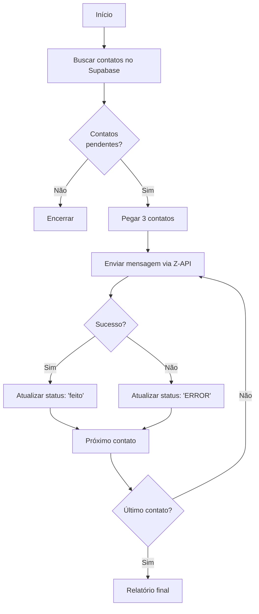

# Bot de Envio de Mensagens via WhatsApp (Z-API + Supabase)


Este projeto automatiza o envio de mensagens personalizadas via WhatsApp usando a API Z-API, integrado com o Supabase para gerenciamento de contatos.

---

## 📦 Pré-requisitos

* Python 3.13.x
* Conta no Supabase
* Conta no Z-API
* Biblioteca de testes (opcional)

---


## ⚙️ Configuração Inicial

### 1. Instalar dependências

```bash
pip install requests python-dotenv supabase
```

### 2. Configurar tabela no Supabase

Execute o SQL da pasta `Tabela_em_SQL` no Supabase para criar a tabela necessária.

### 3. Inserir dados de exemplo

Insira contatos com nome e número no formato internacional:

```sql
INSERT INTO tabela_contatos (nome, numero)
VALUES
('João Silva', '+5511999999999'),
('Maria Souza', '+5511888888888');
```

## 4. Configuração do Z-API

* Crie uma instância no painel Z-API
* Configure o webhook de recebimento (opcional)
* Gere os tokens necessários:

  * Instance ID
  * Instance Token
  * Client Token


### 5. Configurar variáveis de ambiente

Modifique o arquivo `.env` com suas informações:

```env
# Supabase
SUPABASE_URL=seu_url_supabase
SUPABASE_KEY=seu_key_supabase

# Mensagem
MESSAGE_TEMPLATE=Olá {nome}, tudo bem com você?

# Z-API
ZAPI_INSTANCE_ID=sua_instance_id
ZAPI_INSTANCE_TOKEN=seu_instance_token
ZAPI_CLIENT_TOKEN=seu_client_token
```

## 🚀 Como Executar

```bash
python main.py
```

---

## 🔄 Fluxo do Código



---

## 📊 Monitoramento

Os logs são exibidos no terminal em tempo real:

```log
2025-08-14 12:00:00 INFO: Contatos com Status pendente encontrados: 2
2025-08-14 12:00:01 INFO: Enviado para João Silva (+5511999999999)
2025-08-14 12:00:02 ERROR: Falha ao enviar para Maria Souza (+5511888888888): 401: Unauthorized
```


## ✅ Melhores Práticas

* Mantenha o `.env` fora do versionamento (adicione ao `.gitignore`)
* Limite o número de envios por execução
* Teste com números pessoais antes de produção
* Monitore os status de erro no Supabase

---

## 🛠 Solução de Problemas

| Erro Comum             | Solução                                  |
| ---------------------- | ---------------------------------------- |
| 401 Unauthorized       | Verifique tokens Z-API                   |
| Supabase retornou erro | Confira URL e chave do Supabase          |
| Contato sem número     | Valide dados na tabela                   |
| Variáveis faltando     | Verifique arquivo `.env`                 |
| Timeout Z-API          | Aumente timeout ou verifique conexão     |
| Mensagem não formatada | Verifique o `MESSAGE_TEMPLATE` no `.env` |

---

## 🔒 Segurança

* Nunca compartilhe seu `.env`
* Revogue tokens comprometidos imediatamente
* Use variáveis de ambiente em ambientes de produção
* Restrinja permissões da tabela no Supabase

---

## 🚧 Roadmap

* Suporte a anexos/mídia
* Agendamento de mensagens
* Confirmação de entrega via webhook
* Painel de monitoramento web
* Suporte a múltiplos templates
* Sistema de filas para envio em massa

---

## 📂 Estrutura do Projeto

```
.
├── main.py                 # Script principal
├── .env                    # Configurações sensíveis
├── Tabela_em_SQL/          # Scripts SQL para o Supabase
│   └── create_table.sql    # Criação da tabela
├── requirements.txt        # Dependências
└── README.md               # Documentação
```

> Nota: Sempre teste com números de teste antes de enviar para contatos reais; E no formato "+5511999999999"
> Respeite as políticas de uso do WhatsApp e da Z-API.